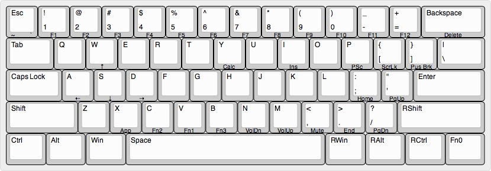

# 客制键盘mac刷写工具
- 安装 [homebrew](http://brew.sh), 在terminal.app中输入：
    ` ruby -e "$(curl -fsSL https://raw.githubusercontent.com/Homebrew/install/master/install)"`

- 安装 [dfu-programmer](http://dfu-programmer.github.io), 在terminal中输入：` brew install dfu-programmer`

+ 下载本工具，在terminal中输入：`git clone https://github.com/sleep2death/keyboard_flash.git`

+ 刷机(**刷之前别忘了按一下键盘背面的小按钮**), 在terminal中输入：`./reflash-dfu.sh <hex文件> <eeprom文件>`。例如：`./reflash-dfu.sh amj60.hex keymap.eep`

+ 本工具自带的配列如图：

>
